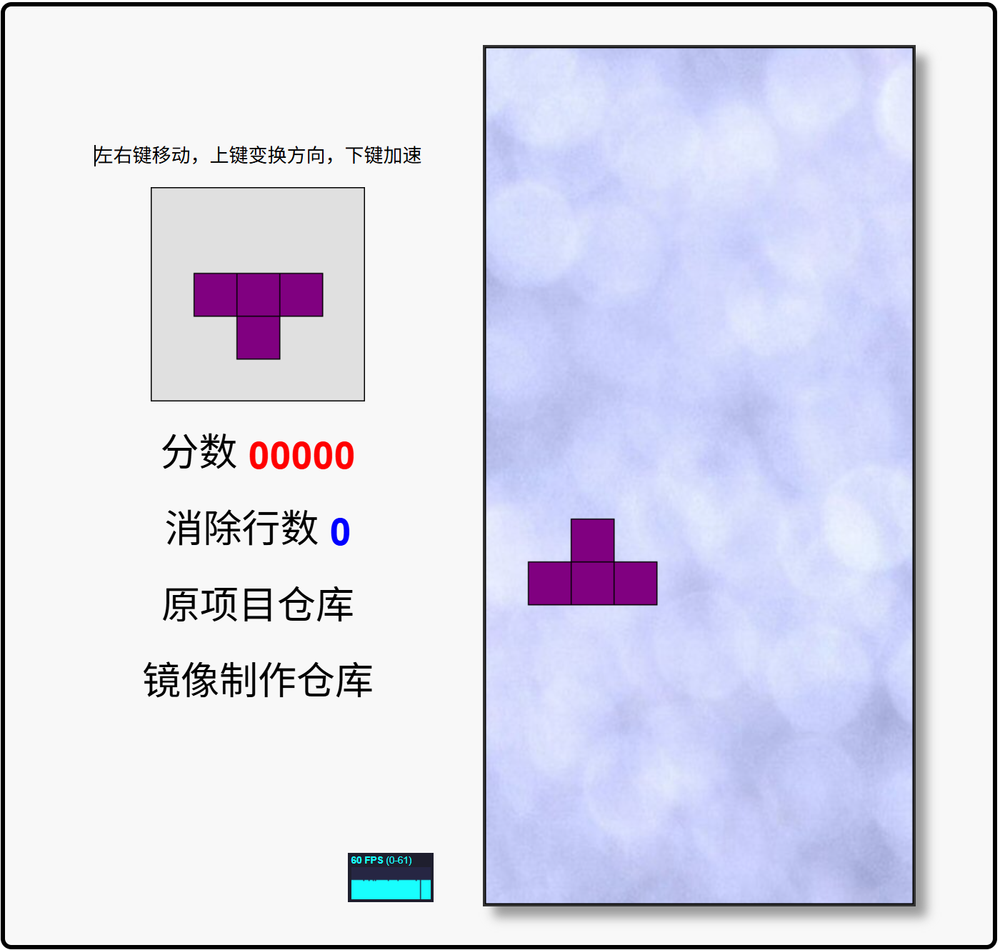

# Javascript Tetris 俄罗斯方块
=================

## 部署说明

首先感谢原作者的开源。[原项目地址](https://github.com/jakesgordon/javascript-tetris)

具体汉化了那些内容，请参考[翻译说明](./翻译说明.md)。

我看不懂代码，所以只做汉化，有问题，请到原作者仓库处反馈。

本人提供这个项目在 NAS、服务器等的有偿远程部署服务，有需要可联系。  
微信号 `E-0_0-`  
闲鱼搜索用户 `明月人间`  
或者邮箱 `firfe163@163.com`  
如果这个项目有帮到你。欢迎start。

有其他的项目的汉化需求，欢迎提issue。或其他方式联系通知。

### 镜像

从阿里云或华为云镜像仓库拉取镜像，注意填写镜像标签，镜像仓库中没有`latest`标签

容器内部端口 3000

```bash
docker pull swr.cn-north-4.myhuaweicloud.com/firfe/tetris-2:2016.01.06
```

### docker run 命令部署

```bash
docker run -d \
--name tetris-2 \
--network bridge \
--restart always \
--log-opt max-size=1m \
--log-opt max-file=3 \
-p 3000:3000 \
swr.cn-north-4.myhuaweicloud.com/firfe/tetris-2:2016.01.06
```
### compose 文件部署 👍推荐

```yaml
#version: '3.9'
services:
  tetris-2:
    container_name: tetris-2
    image: swr.cn-north-4.myhuaweicloud.com/firfe/tetris-2:2016.01.06
    network_mode: bridge
    restart: always
    logging:
      options:
        max-size: 1m
        max-file: '3'
    ports:
      - 3000:3000
```

## 修改说明

这里对除了汉化之外的代码修改的说明。  
增加修改部分具体见 [修改说明](./修改说明.md)。

`./README.md` 文件翻译，增加 `## 部署说明`、`## 修改说明`、`## 效果截图` 部分。

增加目录 `./图片`
新增文件 `./.dockerignore`、`./Dockerfile`、`./翻译说明.md`、`./修改说明.md`

## 效果截图




## An HTML5 Tetris Game 一个 HTML5 俄罗斯方块游戏

 * [play the game](http://codeincomplete.com/projects/tetris/)  
   [玩游戏](http://codeincomplete.com/projects/tetris/)
 * 阅读[博客文章](http://codeincomplete.com/posts/2011/10/10/javascript_tetris/)  
   read a [blog article](http://codeincomplete.com/posts/2011/10/10/javascript_tetris/)
 * view the [source](https://github.com/jakesgordon/javascript-tetris)  
   查看[源代码](https://github.com/jakesgordon/javascript-tetris)

>> _*SUPPORTED BROWSERS*: Chrome, Firefox, Safari, Opera and IE9+_  
>> 支持的浏览器: Chrome、Firefox、Safari、Opera 和 IE9+

## FUTURE 未来计划
======

* menu  
  菜单
* animation and fx  
  动画和特效
* levels  
  关卡
* high scores  
  最高分
* touch support  
  触摸支持
* music and sound fx  
  音乐和音效


## License 许可证
=======

[MIT](http://en.wikipedia.org/wiki/MIT_License) license.   
[MIT](http://en.wikipedia.org/wiki/MIT_License) 许可证。


